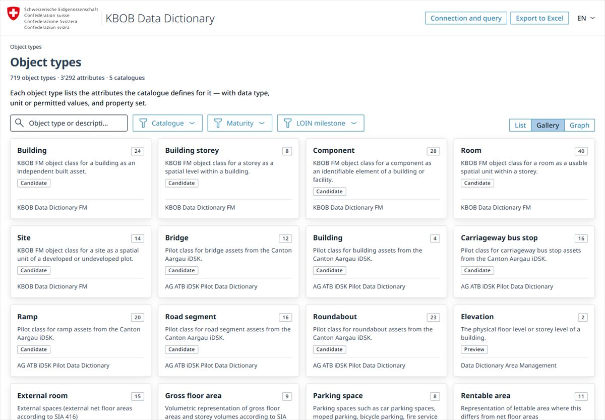
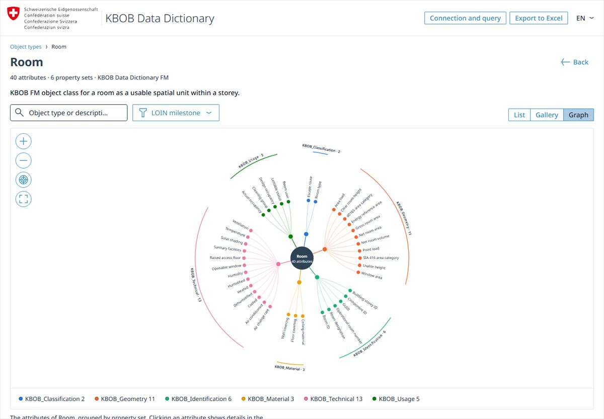

# KBOB Data Dictionary Explorer

<p align="center">
  <a href="https://bbl-dres.github.io/kbob-data/">
    
  </a>
</p>

[](https://bbl-dres.github.io/kbob-data/)
[](LICENSE)

> [!CAUTION]
> Prototype over integration data. It reads the public KBOB catalogue through LINDAS but does not publish or modify the catalogue; the integration graph is not a final production release.

A browser-based explorer that turns the [KBOB Data Dictionary](https://github.com/KBOB-admin/KBOB-data-dictionary) into practical BIM and facility-management views.

## Demo

**Live demo:** https://bbl-dres.github.io/kbob-data/

<p align="center">
  
  
</p>

## Features

- Browse and filter object types by catalogue, maturity, and LOIN milestone.
- Inspect attributes, units, value lists, property sets, and IFC mappings.
- Switch between list, gallery, and accessible graph views.
- Use German, French, Italian, or English labels.
- Export object types and attributes to XLSX.
- Inspect the SPARQL queries used to load catalogue data.
- Read the guide (Anleitung): what a data dictionary is, where the data comes from, how to use the app.

## Run locally

```bash
python -m http.server 8000
```

Open <http://localhost:8000/>. For authenticated or alternate SPARQL endpoints, use `python lindas-proxy.py` and open <http://localhost:8765/>.

## Documentation

- [Data model](docs/DATAMODEL.md)
- [Design](docs/DESIGN.md)
- [Technical review](docs/REVIEW.md)
- [Code review](docs/CODE-REVIEW.md)
- [Interface reviews](docs/GRAPH-REVIEW.md)
- [UX and CD review](docs/UX-REVIEW.md)
- [Spacing and layout review](docs/SPACING-REVIEW.md)

## License

Project code is covered by the [MIT License](LICENSE). Vendored fonts, icons, and design tokens retain their original licenses.
