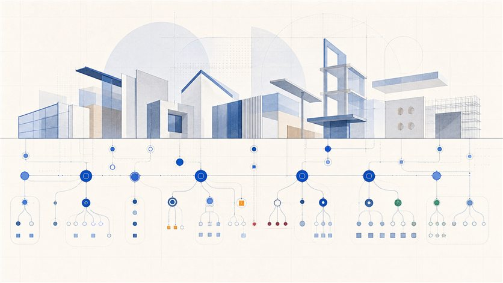

# KBOB Data Dictionary Explorer

<p align="center">
  <a href="https://bbl-dres.github.io/kbob-data/">
    
  </a>
</p>

[](https://bbl-dres.github.io/kbob-data/)
[](LICENSE)


> [!CAUTION]
> **Prototype over integration data.** The explorer queries the public KBOB catalogue through the LINDAS integration endpoint. It does not publish or modify the catalogue, and the integration graph is not a final production release.

A browser explorer for the [KBOB Data Dictionary](https://github.com/KBOB-admin/KBOB-data-dictionary). It translates the RDF model into the questions a BIM or facility manager asks: **which object type needs which attributes, in what format, from which property set, and with which allowed values?**

## Highlights

- Flat, faceted access to object types, with catalogue, maturity and LOIN-milestone filters and shareable URL state.
- Object and attribute detail with descriptions, datatypes, units, value lists, property sets and IFC mappings.
- List, gallery and accessible SVG graph views, including complete text alternatives and keyboard controls.
- German, French, Italian and English UI and catalogue labels, with explicit language fallback.
- Client-side XLSX export with Object types, Attributes and Info sheets; no spreadsheet library required.
- Inspectable SPARQL queries, lazy detail loading, request deduplication and protection against stale responses.

## KBOB and stakeholders

The **Coordination Conference for Public Sector Construction and Property Services (KBOB)** coordinates and represents member public-sector construction and property bodies from the Confederation, cantons, cities and municipalities. Its work covers procurement, standards, sustainability, property operations, digital construction and BIM.

| Stakeholder | Role in this ecosystem |
|---|---|
| [KBOB](https://www.kbob.admin.ch/de/ueber-uns) and its public-owner network | Coordinating body and [catalogue publisher](https://api.i14y.admin.ch/api/public/v1/datasets/019fec56-1bba-7457-8f5d-bc4a67625cf2). Formal members span all levels of government; Swiss Federal Railways is an observer. Its [specialist groups](https://www.kbob.admin.ch/de/fachgruppen-und-arbeitsgruppen) are forums for domain work and knowledge exchange. |
| [FOBL/BBL](https://www.bbl.admin.ch/de/aufgaben-und-organisation) | Chairs KBOB and runs its secretariat under [VILB art. 25](https://www.fedlex.admin.ch/eli/cc/2008/857/de#art_25). |
| [Swiss Federal Archives](https://lindas.admin.ch/ecosystem/about-LINDAS/) | Operate LINDAS, the linked-data infrastructure that serves the RDF graph through SPARQL. |
| [Federal Statistical Office / I14Y](https://www.i14y.admin.ch/en/home) | Operate Switzerland's national metadata catalogue, where the dataset and API are described and made discoverable. |
| Populated source dictionaries | Templates currently come from KBOB Data Dictionary FM, AG ATB iDSK Pilot, IFMA Area Management, KBOB Document Types Catalogue and an RTE 26201 BIM railway-lighting dictionary under a VoeV namespace. Their presence records provenance, not joint governance of KBOB. |

## Data model and current status

- The core chain is `DataTemplate -> PropertyRequirement -> Property`, enriched with property sets, contextual datatypes and units, enumerations, LOIN milestones, maturity and IFC alignment. The graph currently provides no SHACL shapes.
- The integration snapshot contains **719 object types**, **3,292 normalised object-type/attribute rows**, **26 property sets** and five populated source dictionaries; 666 object types are document types. The graph contains 3,666 underlying `PropertyRequirement` resources.
- The [I14Y record](https://api.i14y.admin.ch/api/public/v1/datasets/019fec56-1bba-7457-8f5d-bc4a67625cf2) reports publication level `Public`, version `0.3.0` and registration status `Candidate`. In the examined graph, 677 object types are `Candidate` and 42 are `Preview`; none are approved.
- Every requirement currently uses `requirementLevel = included`, so the data does not distinguish mandatory from optional attributes.
- LOIN milestones are attached to data templates; after normalisation, 91 attribute rows inherit at least one. The graph exposes `LZP1`-`LZP9` but does not define or map them to SIA 112 project phases.

## Technical overview

- Static single-page application using vanilla ES5-style JavaScript, HTML and CSS; no framework, dependencies or build step.
- Overview data loads at startup, object details load on demand, value lists load once, and a single all-details query supports full export.
- `js/export.js` writes OOXML and ZIP directly in the browser. `lindas-proxy.py` is an optional standard-library same-origin proxy with gzip and Basic authentication.
- Fourteen dependency-free helper, query, i18n and XLSX tests run with `node --test test/helfer.test.js`.
- KBOB maintains the official [workbook validator](https://github.com/KBOB-admin/KBOB-data-dictionary), [RDF publication pipeline](https://github.com/KBOB-admin/KBOB-data-dictionary-schemaforge) and [NatDD vocabulary](https://github.com/KBOB-admin/KBOB-data-dictionary-schema); this repository is the read-only browser layer.

## Run locally

Serve the repository over HTTP; opening `index.html` through `file://` prevents the runtime requests:

```bash
python -m http.server 8000
```

Then open <http://localhost:8000/>. Use the proxy when the endpoint changes or requires authentication:

```bash
python lindas-proxy.py
python lindas-proxy.py --check
python lindas-proxy.py --user me
```

The proxy serves the app at <http://localhost:8765/> and forwards SPARQL through `/query`.

## References and documentation

| | |
|---|---|
| Service | [I14Y record](https://www.i14y.admin.ch/de/catalog/dataservices/kbob-fm-data-dictionary-sparql/description) · [LINDAS](https://lindas.admin.ch/) |
| Project | [Live explorer](https://bbl-dres.github.io/kbob-data/) · [source](https://github.com/bbl-dres/kbob-data) · [issues](https://github.com/bbl-dres/kbob-data/issues) |
| KBOB | [Website](https://www.kbob.admin.ch/) · [official GitHub organisation](https://github.com/KBOB-admin) |
| Product and code | [`DESIGN.md`](docs/DESIGN.md) · [`REVIEW.md`](docs/REVIEW.md) · [`CODE-REVIEW.md`](docs/CODE-REVIEW.md) |
| Interface | [`GRAPH-REVIEW.md`](docs/GRAPH-REVIEW.md) · [`MOBILE-REVIEW.md`](docs/MOBILE-REVIEW.md) · [`OBLIQUE.md`](docs/OBLIQUE.md) · [`CD-REVIEW.md`](docs/CD-REVIEW.md) · [Oblique](https://github.com/oblique-bit/oblique) |

## License

Original project code is licensed under the [MIT License](LICENSE). Vendored fonts, icons and design tokens originate from the MIT-licensed [Oblique design system](https://github.com/oblique-bit/oblique).
