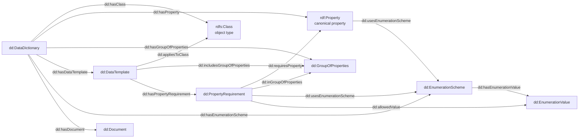

# KBOB / NatDD RDF data model and SPARQL guide

Verified against the LINDAS integration graph and the official KBOB repositories on
**2026-09-01**.

This document describes three things that must be kept separate:

1. the **NatDD core vocabulary**, which defines the RDF terms;
2. the **currently populated LINDAS INT named graph**, which is a mutable data snapshot;
3. the **projection used by this explorer**, which groups and normalises that graph for the UI.

> [!CAUTION]
> The endpoint is an integration service and the vocabulary is a `0.1.0 Public Review
> Draft`. The graph can change without a release in this repository, and the provisional
> `dd:` namespace may migrate before NatDD 1.0. Counts below are observations, not schema
> constraints.

## 1. The important URLs

These similar-looking URLs identify different things. The trailing slash is significant.

| Purpose | URL | Meaning |
|---|---|---|
| SPARQL service used by the app | `https://int.lindas.admin.ch/query` | HTTP endpoint accepting SPARQL queries. The I14Y service record explicitly describes it as LINDAS **INT**. |
| Named graph | `https://lindas.admin.ch/fobl/kbob/dd-fm` | Graph name supplied in `FROM` or `GRAPH`; it is not the endpoint URL. |
| NatDD vocabulary namespace | `https://lindas.admin.ch/fobl/kbob/dd-fm/vocab/` | Base IRI for terms such as `dd:DataTemplate` and `dd:requiresProperty`. It is provisional. |
| KBOB FM dataset series | `https://lindas.admin.ch/fobl/kbob/dd-fm/` | Unversioned `dcat:DatasetSeries` resource. |
| KBOB FM release | `https://lindas.admin.ch/fobl/kbob/dd-fm/0.3.0/` | Versioned `dcat:Dataset` and `dd:DataDictionary` resource inside the named graph. |
| I14Y dataset metadata | [human record](https://www.i14y.admin.ch/en/catalog/datasets/019fec56-1bba-7457-8f5d-bc4a67625cf2/description) · [JSON](https://api.i14y.admin.ch/api/public/v1/datasets/019fec56-1bba-7457-8f5d-bc4a67625cf2) | Catalogue description of KBOB Data Dictionary FM; I14Y does not host the RDF. |
| I14Y SPARQL-service metadata | [human record](https://www.i14y.admin.ch/en/catalog/dataservices/019fec3c-519c-71c0-8626-071d53f11cfe/description) · [JSON](https://api.i14y.admin.ch/api/public/v1/dataservices/019fec3c-519c-71c0-8626-071d53f11cfe) | Catalogue description of the INT endpoint and the dataset it serves. |
| Generic LINDAS production endpoint | `https://ld.admin.ch/query` | Endpoint listed by the [LINDAS ecosystem documentation](https://lindas.admin.ch/ecosystem/LINDAS-ecosystem). Do not silently substitute it for the catalogued KBOB INT endpoint. |

On 2026-09-01, an `ASK` for this named graph returned `true` on INT and `false` on the
generic production endpoint. This document therefore describes an INT snapshot, not an
assumed production copy.

The I14Y service record reports version `0.3.0`, publication level `Public`, access
rights `PUBLIC`, registration status `Candidate`, and service licence
[`terms_by`](https://www.dcat-ap.ch/vocabulary/licenses/20240716.html) (open use with
source attribution). The related I14Y **dataset** record also reports
version `0.3.0` and `Candidate`, but currently has no explicit dataset licence field.
Those catalogue-level values are not the same as the `dd:status` values on individual
RDF resources.

## 2. Sources of truth and responsibilities

| Source | Authority and role |
|---|---|
| [NatDD core vocabulary](https://github.com/KBOB-admin/KBOB-data-dictionary-schema) · [tagged 0.1.0 Turtle](https://github.com/KBOB-admin/KBOB-data-dictionary-schema/blob/v0.1.0/ontology/natdd-core.ttl) | **Normative for `dd:` term meanings.** Status: Public Review Draft; issued 2026-08-26; CC0 1.0. Breaking changes are allowed during `0.x`. |
| [SchemaForge](https://github.com/KBOB-admin/KBOB-data-dictionary-schemaforge) | Transforms validated workbooks to RDF/Turtle and I14Y-oriented JSON. Its mapping documentation explains how workbook cells produce triples. |
| [Workbook and validator](https://github.com/KBOB-admin/KBOB-data-dictionary) | Source templates, examples, validation and safe normalisation before RDF publication. |
| [LINDAS](https://lindas.admin.ch/ecosystem/about-LINDAS/) | Linked-data infrastructure operated by the Swiss Federal Archives. It stores and serves the graph; it is not the dataset publisher. |
| [I14Y](https://www.i14y.admin.ch/en/home) | Metadata catalogue operated by the Federal Statistical Office. It describes the dataset and API; the actual RDF remains in LINDAS. |
| [KBOB](https://www.kbob.admin.ch/de/ueber-uns) | Publisher named by both I14Y records. BBL chairs KBOB and hosts its secretariat; this does not make BBL or I14Y the data publisher. |
| [`js/data.js`](../js/data.js) | App-specific SPARQL and normalisation. It is a consumer, not a normative schema definition. |
| [Oblique](https://github.com/oblique-bit/oblique) | UI design-system provenance only; it has no role in the RDF model. |

There are several independent version axes:

- NatDD vocabulary: `0.1.0`;
- KBOB FM data release and I14Y records: `0.3.0`;
- source-workbook filenames: currently include several other versions;
- this browser application: `1.0.0` in `js/data.js`.

None of these version numbers should be substituted for another.

## 3. Publication and query flow

```text
validated workbook
        │
        ▼
SchemaForge transformation ───────────────► I14Y-oriented metadata bundle
        │                                      │
        ▼                                      ▼ downstream/manual publication
NatDD RDF/Turtle                         I14Y catalogue records
        │                                (metadata only; creationType Manual)
        ▼
named LINDAS INT graph
        │
        ▼
SPARQL endpoint ──► this read-only explorer
```

SchemaForge generates RDF and an I14Y-oriented bundle; its documented
[proof-of-concept](https://github.com/KBOB-admin/KBOB-data-dictionary-schemaforge/blob/main/docs/i14y-lindas-poc-mapping.md)
does not itself publish through the I14Y partner API or import code lists. Publishing RDF
to LINDAS is also a separate, explicit authenticated operation. The browser issues only
read-only `SELECT` queries: it neither publishes RDF nor modifies the catalogue.

## 4. Conceptual model

The key modelling decision is the n-ary `PropertyRequirement`. A canonical property is
defined once; its contextual use for a class, template, group, datatype, unit and value
subset is represented by a separate requirement resource.



The canonical property carries its label, definition, base datatype, base unit and IFC
alignment. The requirement carries only the template-specific context. The model can
therefore represent different uses of the same property without duplicating its semantic
definition. In the current SchemaForge mapping, however, contextual datatype and unit are
copied from the selected canonical property rather than overridden in the requirement
matrix; class, template, group and enumeration subset remain genuinely contextual.

## 5. Prefixes

The following prefix block covers the model and all query examples in this document:

```sparql
PREFIX dd:     <https://lindas.admin.ch/fobl/kbob/dd-fm/vocab/>
PREFIX dcat:   <http://www.w3.org/ns/dcat#>
PREFIX dct:    <http://purl.org/dc/terms/>
PREFIX owl:    <http://www.w3.org/2002/07/owl#>
PREFIX prov:   <http://www.w3.org/ns/prov#>
PREFIX qudt:   <http://qudt.org/schema/qudt/>
PREFIX rdf:    <http://www.w3.org/1999/02/22-rdf-syntax-ns#>
PREFIX rdfs:   <http://www.w3.org/2000/01/rdf-schema#>
PREFIX schema: <https://schema.org/>
PREFIX skos:   <http://www.w3.org/2004/02/skos/core#>
PREFIX xsd:    <http://www.w3.org/2001/XMLSchema#>
```

## 6. Complete NatDD core vocabulary

The `0.1.0` vocabulary defines 10 classes and 38 properties. “INT count” is the
number of resources or triples observed in the named graph on 2026-09-01. A zero means
the term is defined by the vocabulary but absent from that snapshot.

The vocabulary base IRI itself is declared as an `owl:Ontology`, with
`dct:creator <https://www.kbob.admin.ch/>`, `dct:issued "2026-08-26"^^xsd:date`,
`owl:versionInfo "0.1.0 Public Review Draft"`, version IRI
`https://lindas.admin.ch/fobl/kbob/dd-fm/vocab/0.1.0/`, and a CC0 1.0 licence. That
licence covers the vocabulary artifact; it must not be assumed to license the live
dataset, whose I14Y dataset record currently has no explicit licence field.

The ontology declarations are currently repository artifacts, not graph content. On the
verification date, the named graph contained no triples describing
`dd:DataDictionary` as a vocabulary term, and HTTP dereferencing of the vocabulary and
term IRIs returned `404`. Consumers needing domains, ranges, deprecations or ontology
metadata must load the [tagged Turtle artifact](https://github.com/KBOB-admin/KBOB-data-dictionary-schema/blob/v0.1.0/ontology/natdd-core.ttl);
querying the data graph alone is insufficient.

RDF names are case-sensitive. In particular, `dd:AllowedValue` is the deprecated class,
whereas `dd:allowedValue` is the property linking a requirement to an explicit value.

OWL/RDFS domains and ranges are inference statements, not closed-world validation rules.
Where the vocabulary deliberately declares no domain or range, this document reports the
intended SchemaForge use without pretending that an OWL restriction exists.

### 6.1 Classes

| Class | Superclass / equivalence | Meaning | INT resources |
|---|---|---|---:|
| `dd:DataDictionary` | `dcat:Dataset` | Versioned publication unit containing governed definitions and requirements. | 7 |
| `dd:GroupOfProperties` | — | Logical property group within a dictionary. | 26 |
| `dd:EnumerationScheme` | `skos:ConceptScheme` | Controlled scheme of values for a property or requirement. | 70 |
| `dd:EnumerationValue` | `skos:Concept` | One governed value in an enumeration scheme. | 1,096 |
| `dd:AllowedValue` | subclass of and equivalent to `dd:EnumerationValue`; deprecated | Compatibility type retained for older publications. New data should use `dd:EnumerationValue`. | 1,096 |
| `dd:Document` | — | Document referenced by dictionary resources. | 5 |
| `dd:DocumentType` | `rdfs:Class` | Terminal, orderable or deliverable class in a document taxonomy. | 666 |
| `dd:TaxonomyNode` | `rdfs:Class` | Non-terminal class used to navigate a taxonomy. | 98 |
| `dd:DataTemplate` | — | Contextual collection of information requirements applying to one or more classes. | 830 |
| `dd:PropertyRequirement` | — | Contextual use of a canonical property inside a data template. | 3,666 |

### 6.2 Dictionary composition properties

| Property | RDF type | Declared domain → range | Meaning | INT triples |
|---|---|---|---|---:|
| `dd:hasClass` | `owl:ObjectProperty` | `dd:DataDictionary` → `rdfs:Class` | Dictionary contains a class. | 818 |
| `dd:hasProperty` | `owl:ObjectProperty` | `dd:DataDictionary` → `rdf:Property` | Dictionary contains a canonical property. | 245 |
| `dd:hasGroupOfProperties` | `owl:ObjectProperty` | `dd:DataDictionary` → `dd:GroupOfProperties` | Dictionary contains a property group. | 26 |
| `dd:hasEnumerationScheme` | `owl:ObjectProperty` | `dd:DataDictionary` → `dd:EnumerationScheme` | Dictionary contains a value scheme. | 70 |
| `dd:hasDocument` | `owl:ObjectProperty` | `dd:DataDictionary` → `dd:Document` | Dictionary contains a referenced document. | 5 |
| `dd:hasDataTemplate` | `owl:ObjectProperty` | `dd:DataDictionary` → `dd:DataTemplate` | Dictionary contains a data template. | 830 |

### 6.3 Enumeration properties

| Property | RDF type | Declared domain → range | Meaning | INT triples |
|---|---|---|---|---:|
| `dd:usesEnumerationScheme` | `owl:ObjectProperty` | open → `dd:EnumerationScheme` | A property or requirement uses a value scheme. | 2,846 |
| `dd:enumerationSchemeForProperty` | `owl:ObjectProperty` | `dd:EnumerationScheme` → `rdf:Property` | Generated reverse link from scheme to canonical property. | 65 |
| `dd:hasEnumerationValue` | `owl:ObjectProperty` | `dd:EnumerationScheme` → `dd:EnumerationValue` | Scheme contains a governed value. | 1,096 |
| `dd:hasAllowedValue` | `owl:ObjectProperty` | open → `dd:EnumerationValue` | Canonical property's complete, directly accessible value set. | 1,040 |
| `dd:valueOfProperty` | `owl:ObjectProperty` | `dd:EnumerationValue` → `rdf:Property` | Inverse of `dd:hasAllowedValue`. | 1,040 |
| `dd:enumerationPosition` | `owl:DatatypeProperty` | `dd:EnumerationValue` → `xsd:integer` | One-based position in source ordering. | 1,096 |

All current enumeration values are typed as `skos:Concept`,
`dd:EnumerationValue` and the deprecated `dd:AllowedValue`. Membership is also expressed
with `skos:inScheme`; `skos:member` is intentionally not used for concept schemes.

### 6.4 Data-template and contextual-requirement properties

| Property | RDF type | Declared domain → range | Meaning | INT triples |
|---|---|---|---|---:|
| `dd:appliesToClass` | `owl:ObjectProperty` | open → `rdfs:Class` | Class to which a template applies. SchemaForge also emits the same context on each requirement. | 4,496 |
| `dd:includesGroupOfProperties` | `owl:ObjectProperty` | `dd:DataTemplate` → `dd:GroupOfProperties` | Group organised by a template; multiple triples express `0..n` groups. | 916 |
| `dd:referencesDocument` | `owl:ObjectProperty` | open → `dd:Document` | Dictionary resource references a document. | 1,270 |
| `dd:documentItemReference` | `owl:DatatypeProperty` | `dd:Document` → `xsd:string` | Source-defined clause, item or section reference. | 8 |
| `dd:hasPropertyRequirement` | `owl:ObjectProperty` | `dd:DataTemplate` → `dd:PropertyRequirement` | Template contains a contextual requirement. | 3,666 |
| `dd:requirementOfDataTemplate` | `owl:ObjectProperty` | `dd:PropertyRequirement` → `dd:DataTemplate` | Inverse of `dd:hasPropertyRequirement`. | 3,666 |
| `dd:requiresProperty` | `owl:ObjectProperty` | `dd:PropertyRequirement` → `rdf:Property` | Requirement uses a canonical property. | 3,666 |
| `dd:requiredByTemplate` | `owl:ObjectProperty` | `rdf:Property` → `dd:PropertyRequirement` | Inverse of `dd:requiresProperty`; despite its name, the object is a requirement. | 3,666 |
| `dd:inGroupOfProperties` | `owl:ObjectProperty` | `dd:PropertyRequirement` → `dd:GroupOfProperties` | Property group in this template context. | 3,666 |
| `dd:allowedValue` | `owl:ObjectProperty` | `dd:PropertyRequirement` → `dd:EnumerationValue` | Explicit contextual subset of permitted values. | 5,009 |
| `dd:usesCompleteValueScheme` | `owl:DatatypeProperty` | `dd:PropertyRequirement` → `xsd:boolean` | `true` uses the complete scheme; `false` uses explicit `dd:allowedValue` links. | 2,781 |
| `dd:inclusionMarker` | `owl:DatatypeProperty` | `dd:PropertyRequirement` → `xsd:string` | Normalised raw workbook marker, normally `x` or a serialised list. | 3,666 |
| `dd:requirementLevel` | `owl:DatatypeProperty` | `dd:PropertyRequirement` → `xsd:string` | Published inclusion level; it does **not** assert SHACL or IDS cardinality. | 3,666 |
| `dd:contextualDatatype` | `owl:DatatypeProperty` | `dd:PropertyRequirement` → `xsd:string` | Datatype applying in this requirement context. | 3,666 |
| `dd:contextualUnit` | `rdf:Property` | `dd:PropertyRequirement` → open | Contextual unit; governed IRI preferred, source literal allowed. INT contains 156 IRI and 38 literal objects. | 194 |

In the current graph, all 3,666 requirements have exactly one template, property, class,
group, contextual datatype, inclusion marker and requirement level. That is an observed
publication invariant, not a formal minimum/maximum cardinality.

### 6.5 Property, alignment and governance metadata

| Property | RDF type | Declared domain → range | Meaning | INT triples |
|---|---|---|---|---:|
| `dd:datatype` | `owl:DatatypeProperty` | open → `xsd:string` | Canonical property's published base datatype. | 245 |
| `dd:ifcDatatype` | `owl:DatatypeProperty` | open → `xsd:string` | Published IFC datatype name. | 245 |
| `dd:alignedWithIfcPset` | `owl:ObjectProperty`, subproperty of `rdfs:seeAlso` | open → open | IFC property-set/quantity-set alignment. INT contains 52 IRI and 22 literal objects. | 74 |
| `dd:ifcObjectEntity` | `owl:ObjectProperty`, subproperty of `rdfs:seeAlso` | open → open | IFC 4.3 object-entity anchor. | 54 |
| `dd:ifcPredefinedType` | `owl:ObjectProperty`, subproperty of `rdfs:seeAlso` | open → open | IFC 4.3 predefined-type anchor. | 9 |
| `dd:dictionaryRecord` | `owl:ObjectProperty`, subproperty of `rdfs:seeAlso` | open → open | Link to an externally managed registry/catalogue record. | 0 |
| `dd:status` | `owl:DatatypeProperty` | open → `xsd:string` | Lifecycle/governance status. | 1,986 |
| `dd:revision` | `owl:DatatypeProperty` | open → `xsd:string` | Document revision. | 5 |
| `dd:loinMilestone` | `owl:DatatypeProperty` | open → `xsd:string` | LOIN milestone on a data template. | 117 |
| `dd:loinRole` | `owl:DatatypeProperty` | open → `xsd:string` | LOIN role. | 0 |
| `dd:loinUsecase` | `owl:DatatypeProperty` | open → `xsd:string` | LOIN use case. | 0 |

## 7. Reused standard and external vocabularies

NatDD follows a reuse-before-invention policy. Generic publication, provenance, label,
value-list, unit and mapping semantics come from established vocabularies.
It references their IRIs but deliberately declares no `owl:imports`; consumers decide
whether to load those external ontologies.

| Vocabulary | Use in this graph |
|---|---|
| RDF/RDFS | Resource types, canonical `rdf:Property`, object classes, labels, comments, subclass taxonomy and scalar `rdf:value`. |
| SKOS | Definitions, preferred labels, notations, concept schemes/values and semantic mappings. |
| DCAT + Dublin Core | Dictionary releases/series, source, identifiers, descriptions, publisher and version relations. |
| PROV-O | Source-workbook derivation and responsible agents. |
| QUDT | Governed unit IRIs via `qudt:hasUnit`. |
| OWL | Dataset version information and the external vocabulary definition itself. |
| schema.org | Documents are also represented as `schema:CreativeWork`. |
| buildingSMART / bSDD | IFC 4.3 class/property anchors plus provisional compatibility predicates for document and Pset metadata. |

For completeness, these are all 29 non-`dd:` predicates observed in the graph. Together
with the 35 populated `dd:` predicates above, they account for all 64 predicates in the
snapshot.

| Predicate | INT triples | Role |
|---|---:|---|
| `rdf:type` | 9,820 | Resource classification. |
| `rdf:value` | 197 | Safely parsed scalar enumeration values. |
| `rdfs:label` | 5,306 | Human-readable labels. |
| `rdfs:subClassOf` | 760 | Document-taxonomy hierarchy. |
| `rdfs:comment` | 386 | Untagged compatibility/fallback comments. |
| `skos:prefLabel` | 2,405 | Preferred labels, mainly schemes and values. |
| `skos:definition` | 2,101 | Definitions of classes and properties. |
| `skos:notation` | 1,937 | Codes and canonical value notation. |
| `skos:inScheme` | 1,096 | Enumeration-value membership. |
| `skos:related` | 1,040 | Compatibility relationship from property to values. |
| `skos:exactMatch` | 145 | Reviewed semantic/IFC alignment. |
| `skos:broadMatch` | 9 | Broader IFC class alignment for predefined types. |
| `dct:source` | 6,763 | General source/dictionary or workbook reference. |
| `dct:identifier` | 859 | Publisher-assigned identifiers. |
| `dct:modified` | 827 | Resource modification metadata. |
| `dct:description` | 48 | Publication descriptions. |
| `dct:hasVersion` | 7 | Dataset series to versioned release. |
| `dct:isVersionOf` | 7 | Versioned release to series. |
| `dct:publisher` | 5 | Document publisher metadata. |
| `prov:wasDerivedFrom` | 6,763 | Actual derivation from a source workbook/entity. |
| `prov:wasAttributedTo` | 827 | Responsible agent. |
| `dcat:inSeries` | 7 | Release membership in a dataset series. |
| `owl:versionInfo` | 7 | Dictionary release version. |
| `qudt:hasUnit` | 189 | Governed unit IRI. |
| `https://identifier.buildingsmart.org/uri/referencesDocument` | 1,270 | bSDD compatibility document link. |
| `https://identifier.buildingsmart.org/uri/documentCode` | 12 | bSDD compatibility document codes. |
| `https://identifier.buildingsmart.org/uri/documentItemReference` | 8 | bSDD compatibility document item reference. |
| `https://identifier.buildingsmart.org/uri/hasDocument` | 5 | bSDD compatibility dictionary-document link. |
| `https://bsdd.buildingsmart.org/def#PropertySet` | 74 | Provisional IFC Pset/Qto compatibility value. |

The graph uses 19 distinct `rdf:type` objects. Besides the 10 NatDD classes listed above,
it contains `rdfs:Class` (818 resources), `rdf:Property` (245), `skos:Concept` (1,096),
`skos:ConceptScheme` (70), `dcat:Dataset` (7), `dcat:DatasetSeries` (7), `prov:Entity`
(7), `schema:CreativeWork` (5), and buildingSMART `ReferenceDocument` (5). These sets
overlap by design.

## 8. Resource URI strategy

Each dictionary has a versioned base URI. Resources are minted beneath it:

```text
.../{version}/classes/{class-id}
.../{version}/properties/{property-id}
.../{version}/group-of-properties/{group-id}
.../{version}/data-templates/{template-id}
.../{version}/property-requirements/{template-id}/[{group-id}/]{property-id}
.../{version}/enumerations/{scheme-id}
.../{version}/enumerations/{scheme-id}/values/{position}-{token}
.../{version}/documents/{document-id}
```

The group segment in a property-requirement URI is optional and is omitted when the
source requirement has no group.

Examples from the current KBOB FM release:

```text
https://lindas.admin.ch/fobl/kbob/dd-fm/0.3.0/classes/room
https://lindas.admin.ch/fobl/kbob/dd-fm/0.3.0/properties/guid
```

Enumeration values currently lack dedicated stable IDs in the workbook. Their URIs use
the list position and a canonical value token. Reordering a list or changing that token
can therefore change a value URI. SchemaForge documents stable value-level IDs as a
future model improvement.

I14Y URLs are metadata-record identities and must not be manufactured as RDF resource
identities. A known I14Y record may be linked as a landing page, but it does not replace
the LINDAS dictionary URI.

## 9. Current LINDAS INT profile

The following profile was obtained with read-only queries on 2026-09-01. The graph does
not expose a reliable snapshot timestamp, so the retrieval date is the only timestamp
claimed here.

| Metric | Observed value |
|---|---:|
| RDF triples | 98,794 |
| Distinct subjects | 6,777 |
| Distinct predicates | 64 |
| Distinct objects | 17,062 |
| Declared classes | 818 |
| Classes used by data templates (the app's object types) | 719 |
| Canonical properties declared / used by requirements | 245 / 231 |
| Data templates | 830 |
| Property requirements | 3,666 |
| Normalised unique class/property/group rows | 3,292 |
| Property groups | 26 |
| Enumeration schemes / values | 70 / 1,096 |
| Documents | 5 |

The difference between 3,666 requirements and 3,292 normalised rows is intentional:
multiple template requirements can resolve to the same class/property/group tuple. The
app collapses those tuples and unions their LOIN milestones.

### 9.1 Dictionary releases in the graph

| Dictionary release | Version | Templates contributing to the app overview |
|---|---:|---:|
| AG ATB iDSK Pilot Data Dictionary | 0.1.0 | 117 |
| KBOB Data Dictionary FM | 0.3.0 | 5 |
| Data Dictionary Area Management | 0.5.0 | 8 |
| SIA 416:2003 | 0.0.1 | 0 |
| KBOB Document Types Catalogue | 0.0.1 | 666 |
| SBB FDK Data Dictionary | 3.0.0 | 0 |
| RTE 26201 BIM railway-lighting dictionary | 0.0.1 | 34 |

There are seven `dd:DataDictionary` resources, but only five are referenced as
`dct:source` by the current templates. Consequently the explorer displays five source
catalogues, not seven dictionary resources.

| Populated template source | Classes | Templates | Requirements |
|---|---:|---:|---:|
| KBOB Document Types Catalogue | 666 | 666 | 2,657 |
| RTE 26201 BIM railway-lighting dictionary | 34 | 34 | 328 |
| Data Dictionary Area Management | 8 | 8 | 102 |
| AG ATB iDSK Pilot Data Dictionary | 6 | 117 | 465 |
| KBOB Data Dictionary FM | 5 | 5 | 114 |

### 9.2 Datatypes, lifecycle and LOIN

Canonical property datatypes are string tokens rather than XSD datatype IRIs:

| Token | Properties | Requirements |
|---|---:|---:|
| `STRING` | 123 | 3,194 |
| `REAL` | 68 | 334 |
| `BOOLEAN` | 39 | 59 |
| `INTEGER` | 14 | 70 |
| `TIME` | 1 | 9 |

All 3,666 requirements currently have `dd:requirementLevel "included"`. This means
“represented in the template”, not mandatory. The graph provides no `minCount`,
`maxCount`, required/optional distinction, repeatability or exactly-one constraint.

Among the 719 object types used by templates, `dd:status` is `Candidate` for 677 and
`Preview` for 42. These resource-level lifecycle values are separate from the single
I14Y record-level registration status.

LOIN milestones occur on templates as free string values `LZP1` through `LZP9`. The
snapshot contains 117 `dd:loinMilestone` triples, but neither the vocabulary nor the graph
defines those tokens or maps them to SIA phases. `dd:loinRole` and `dd:loinUsecase` are
defined by the vocabulary but currently unpopulated. All 117 milestone triples currently
come from the AG ATB iDSK source.

### 9.3 Enumerations

- 65 canonical properties use an enumeration scheme.
- 2,781 requirements use a scheme: 114 use the complete scheme and 2,667 use an
  explicit subset.
- The subset requirements carry 5,009 `dd:allowedValue` links.
- 885 requirements do not use an enumeration scheme.
- A canonical property remains linked to its complete scheme even when a requirement
  selects only a subset.
- Every observed `dd:allowedValue` is also a member of the requirement's referenced
  scheme.
- Five schemes containing 56 values have no canonical-property link and are not used by
  any current requirement.

### 9.4 Languages

The graph is unevenly multilingual. Current `rdfs:label` coverage is 2,935 English,
2,279 German, 84 French and 8 Italian resources. `skos:definition` is populated only in
German and English in this snapshot. A French or Italian interface must therefore expect
fallbacks.

The app queries labels in this order:

```text
selected language → German (including untagged literals) → English
```

For English the order is English → German. Descriptions use `skos:definition` in the
same language order and insert an untagged/German `rdfs:comment` after the German
definition as an additional fallback.

## 10. How this explorer projects the graph

The browser intentionally does not expose every RDF resource one-for-one.

1. **Overview query:** one row per class and property group, counting distinct canonical
   properties and aggregating datatypes and template-level LOIN milestones.
2. **Detail query:** one row per property and group for a selected class. It resolves
   contextual datatype/unit, enumeration scheme, status and IFC alignment.
3. **Enumeration query:** loads all scheme values once on first detail access.
4. **Full-export query:** the detail shape without a class filter, so one request can
   populate every detail cache.

The current enumeration query is deliberately scheme-wide: it reads
`dd:hasEnumerationValue` but does not join through a `dd:PropertyRequirement`. As a
result, it does not enforce contextual `dd:allowedValue` subsets and can display values
that are part of the canonical scheme but are not permitted for a particular object
type. Consumers that need the effective allowed set should use the two-branch query in
[section 11.5](#115-resolve-complete-and-contextual-allowed-values).

Normalisation rules relevant to consumers:

- `STRING` plus a populated enumeration is displayed as **Selection**;
- boolean `true/false` or yes/no lists are hidden when they add no information beyond
  `BOOLEAN`;
- unit precedence is requirement `dd:contextualUnit`, requirement `qudt:hasUnit`, then
  property `qudt:hasUnit`;
- known QUDT IRIs are shown as common symbols; unknown IRIs fall back to their final path
  segment;
- repeated template requirements for the same class/property/group become one displayed
  attribute row;
- catalogue and property labels follow the language fallback described above.

The exact generated queries remain inspectable in the app's “Connection and query”
dialog and in [`js/data.js`](../js/data.js).

## 11. Querying the graph

Send SPARQL 1.1 queries to the endpoint with `POST`. The endpoint accepts form-encoded
`query` and returns standard SPARQL result formats:

```bash
curl 'https://int.lindas.admin.ch/query' \
  -H 'Accept: application/sparql-results+json' \
  -H 'Content-Type: application/x-www-form-urlencoded; charset=UTF-8' \
  --data-urlencode 'query=SELECT * FROM <https://lindas.admin.ch/fobl/kbob/dd-fm> WHERE { ?s ?p ?o } LIMIT 10'
```

`FROM <graph>` selects the named graph as the query's default graph. The equivalent
explicit form is `GRAPH <graph> { ... }`. The examples below use `GRAPH` so graph scope
stays visible.

### 11.1 Confirm graph size

```sparql
SELECT
  (COUNT(*) AS ?triples)
  (COUNT(DISTINCT ?s) AS ?subjects)
  (COUNT(DISTINCT ?p) AS ?predicates)
  (COUNT(DISTINCT ?o) AS ?objects)
WHERE {
  GRAPH <https://lindas.admin.ch/fobl/kbob/dd-fm> {
    ?s ?p ?o
  }
}
```

### 11.2 List dictionary releases and series

```sparql
PREFIX dd:   <https://lindas.admin.ch/fobl/kbob/dd-fm/vocab/>
PREFIX dcat: <http://www.w3.org/ns/dcat#>
PREFIX dct:  <http://purl.org/dc/terms/>
PREFIX owl:  <http://www.w3.org/2002/07/owl#>
PREFIX rdfs: <http://www.w3.org/2000/01/rdf-schema#>

SELECT ?dictionary ?identifier ?version ?series ?label
WHERE {
  GRAPH <https://lindas.admin.ch/fobl/kbob/dd-fm> {
    ?dictionary a dd:DataDictionary ;
                owl:versionInfo ?version ;
                dcat:inSeries ?series .
    OPTIONAL { ?dictionary dct:identifier ?identifier }
    OPTIONAL {
      ?dictionary rdfs:label ?label
      FILTER(lang(?label) = "en")
    }
  }
}
ORDER BY ?dictionary
```

### 11.3 List the populated source catalogues

```sparql
PREFIX dd:   <https://lindas.admin.ch/fobl/kbob/dd-fm/vocab/>
PREFIX dct:  <http://purl.org/dc/terms/>
PREFIX rdfs: <http://www.w3.org/2000/01/rdf-schema#>

SELECT ?source ?label
       (COUNT(DISTINCT ?template) AS ?templates)
       (COUNT(DISTINCT ?class) AS ?classes)
       (COUNT(DISTINCT ?requirement) AS ?requirements)
WHERE {
  GRAPH <https://lindas.admin.ch/fobl/kbob/dd-fm> {
    ?template a dd:DataTemplate ;
              dct:source ?source ;
              dd:appliesToClass ?class ;
              dd:hasPropertyRequirement ?requirement .
    OPTIONAL {
      ?source rdfs:label ?label
      FILTER(lang(?label) = "en" || lang(?label) = "")
    }
  }
}
GROUP BY ?source ?label
ORDER BY DESC(?classes) ?source
```

### 11.4 Follow the full class → template → requirement → property chain

This executable example uses the current KBOB FM `Room` class. Replace the `VALUES` IRI
to inspect another object type.

```sparql
PREFIX dd:   <https://lindas.admin.ch/fobl/kbob/dd-fm/vocab/>
PREFIX qudt: <http://qudt.org/schema/qudt/>
PREFIX rdfs: <http://www.w3.org/2000/01/rdf-schema#>
PREFIX skos: <http://www.w3.org/2004/02/skos/core#>

SELECT ?template ?requirement ?property ?propertyLabel ?group ?groupLabel
       ?datatype ?unit ?status ?milestone
WHERE {
  VALUES ?class {
    <https://lindas.admin.ch/fobl/kbob/dd-fm/0.3.0/classes/room>
  }
  GRAPH <https://lindas.admin.ch/fobl/kbob/dd-fm> {
    ?template a dd:DataTemplate ;
              dd:appliesToClass ?class ;
              dd:hasPropertyRequirement ?requirement .
    ?requirement dd:requiresProperty ?property ;
                 dd:inGroupOfProperties ?group ;
                 dd:contextualDatatype ?datatype .

    OPTIONAL {
      ?property rdfs:label ?propertyLabel
      FILTER(lang(?propertyLabel) = "en")
    }
    OPTIONAL {
      ?group rdfs:label ?groupLabel
      FILTER(lang(?groupLabel) = "en")
    }
    OPTIONAL { ?requirement dd:contextualUnit ?unit }
    OPTIONAL { ?property dd:status ?status }
    OPTIONAL { ?template dd:loinMilestone ?milestone }
  }
}
ORDER BY ?groupLabel ?propertyLabel
```

### 11.5 Resolve complete and contextual allowed values

```sparql
PREFIX dd:   <https://lindas.admin.ch/fobl/kbob/dd-fm/vocab/>
PREFIX skos: <http://www.w3.org/2004/02/skos/core#>

SELECT ?requirement ?property ?scheme ?complete ?value ?notation ?label
WHERE {
  GRAPH <https://lindas.admin.ch/fobl/kbob/dd-fm> {
    # A complete requirement inherits every value in its scheme.
    {
      ?requirement a dd:PropertyRequirement ;
                   dd:requiresProperty ?property ;
                   dd:usesEnumerationScheme ?scheme ;
                   dd:usesCompleteValueScheme true .
      ?scheme dd:hasEnumerationValue ?value .
      BIND(true AS ?complete)
    }
    UNION
    # A contextual subset has explicit requirement-to-value links.
    {
      ?requirement a dd:PropertyRequirement ;
                   dd:requiresProperty ?property ;
                   dd:usesEnumerationScheme ?scheme ;
                   dd:usesCompleteValueScheme false ;
                   dd:allowedValue ?value .
      BIND(false AS ?complete)
    }

    OPTIONAL { ?value skos:notation ?notation }
    OPTIONAL {
      ?value skos:prefLabel ?label
      FILTER(lang(?label) = "en")
    }
  }
}
ORDER BY ?requirement ?notation
LIMIT 500
```

### 11.6 Find datatypes, units and IFC alignments

```sparql
PREFIX dd:   <https://lindas.admin.ch/fobl/kbob/dd-fm/vocab/>
PREFIX qudt: <http://qudt.org/schema/qudt/>
PREFIX rdf:  <http://www.w3.org/1999/02/22-rdf-syntax-ns#>
PREFIX rdfs: <http://www.w3.org/2000/01/rdf-schema#>

SELECT ?property ?label ?datatype ?unit ?ifcDatatype ?ifcPset
WHERE {
  GRAPH <https://lindas.admin.ch/fobl/kbob/dd-fm> {
    ?property a rdf:Property ; dd:datatype ?datatype .
    OPTIONAL {
      ?property rdfs:label ?label
      FILTER(lang(?label) = "en")
    }
    OPTIONAL { ?property qudt:hasUnit ?unit }
    OPTIONAL { ?property dd:ifcDatatype ?ifcDatatype }
    OPTIONAL { ?property dd:alignedWithIfcPset ?ifcPset }
  }
}
ORDER BY ?label
```

### 11.7 Traverse the document-type taxonomy

```sparql
PREFIX dd:   <https://lindas.admin.ch/fobl/kbob/dd-fm/vocab/>
PREFIX rdfs: <http://www.w3.org/2000/01/rdf-schema#>
PREFIX skos: <http://www.w3.org/2004/02/skos/core#>

SELECT ?documentType ?code ?label ?parent ?parentLabel
WHERE {
  GRAPH <https://lindas.admin.ch/fobl/kbob/dd-fm> {
    ?documentType a dd:DocumentType .
    OPTIONAL { ?documentType skos:notation ?code }
    OPTIONAL {
      ?documentType rdfs:label ?label
      FILTER(lang(?label) = "en")
    }
    OPTIONAL {
      ?documentType rdfs:subClassOf ?parent .
      OPTIONAL {
        ?parent rdfs:label ?parentLabel
        FILTER(lang(?parentLabel) = "en")
      }
    }
  }
}
ORDER BY ?code
```

### 11.8 Inventory predicates without prior schema knowledge

```sparql
SELECT ?predicate
       (COUNT(*) AS ?triples)
       (COUNT(DISTINCT ?subject) AS ?subjects)
       (SUM(IF(isIRI(?object), 1, 0)) AS ?iriObjects)
       (SUM(IF(isLiteral(?object), 1, 0)) AS ?literalObjects)
WHERE {
  GRAPH <https://lindas.admin.ch/fobl/kbob/dd-fm> {
    ?subject ?predicate ?object
  }
}
GROUP BY ?predicate
ORDER BY DESC(?triples) ?predicate
```

This is useful for detecting publication changes, but it does not replace the normative
ontology: an unused term will not appear, and a predicate count says nothing about its
intended semantics.

## 12. Model boundaries and known gaps

- **No SHACL application profile is published.** The NatDD 0.1 scope explicitly excludes
  SHACL, and the named graph contains no SHACL shapes.
- **No mandatory/optional semantics.** `dd:requirementLevel "included"` and a workbook
  marker `x` must not be interpreted as `sh:minCount 1` or an IDS obligation.
- **No closed-world cardinalities.** OWL domain/range declarations support inference; they
  do not reject missing or repeated values.
- **The namespace is provisional.** KBOB plans a documented term-by-term migration if a
  final federal namespace under `schema.ld.admin.ch` is approved.
- **Status and LOIN values are strings.** They are not controlled RDF concepts in 0.1.
- **Datatypes are tokens.** `STRING`, `REAL`, `INTEGER`, `BOOLEAN` and `TIME` are not XSD
  datatype IRIs.
- **Contextual units deliberately allow IRIs or literals.** `dd:contextualUnit` is a
  generic `rdf:Property`, so the graph's mixed values conform to the vocabulary.
- **Literal IFC Psets are an implementation divergence.** `dd:alignedWithIfcPset` is
  declared as an `owl:ObjectProperty`, but the current graph contains 22 literal fallback
  values alongside 52 IRIs.
- **Enumeration value IRIs are not yet fully stable.** Position and label-derived tokens
  remain part of the current URI strategy.
- **Mapper output is not identical to the core schema.** SchemaForge can emit the
  undeclared fallback predicate `dd:referencesDocumentSection`, while it currently does
  not emit the declared `dd:dictionaryRecord`. Neither predicate occurs in this live
  snapshot; the distinction matters when validating future output. The project's
  [predicate-lineage table](https://github.com/KBOB-admin/KBOB-data-dictionary-schemaforge/blob/main/docs/dd-predicate-lineage.md)
  is explicitly implementation documentation rather than the normative vocabulary.
- **Do not blindly parse `dct:modified` as a timestamp.** It is published as an
  `xsd:string`; the RTE source currently contains pseudo-timezone suffixes such as
  `+00:99` that are not valid `xsd:dateTime` lexical forms.
- **Compatibility triples are duplicated deliberately.** Some buildingSMART predicates and
  `dd:AllowedValue` remain for already published consumers; new code should prefer the
  NatDD 0.1 terms and documented external standards.
- **INT is mutable.** I14Y metadata timestamps record edits to I14Y records, not the last
  refresh time of the RDF graph.
- **The I14Y record is narrower than the graph.** It describes KBOB Data Dictionary FM,
  while the current named graph aggregates resources from seven dictionary releases and
  exposes templates from five of them.

## 13. Maintaining this document

When the data or vocabulary changes:

1. compare the [current vocabulary](https://github.com/KBOB-admin/KBOB-data-dictionary-schema/blob/main/ontology/natdd-core.ttl)
   with the tagged [`0.1.0` baseline](https://github.com/KBOB-admin/KBOB-data-dictionary-schema/blob/v0.1.0/ontology/natdd-core.ttl), or inspect the
   [tag-to-main diff](https://github.com/KBOB-admin/KBOB-data-dictionary-schema/compare/v0.1.0...main);
2. rerun the graph-size, dictionary, source and predicate-inventory queries above;
3. check both I14Y JSON records for endpoint, graph, version, access, registration and
   licence changes;
4. compare the generated app queries in [`js/data.js`](../js/data.js);
5. update the verification date and label every measured value as an observation.

For LINDAS mechanics beyond this model, see the official documentation on
[data access](https://lindas.admin.ch/data-usage/data-usage-types),
[dereferencing](https://lindas.admin.ch/know-how/dereferencing/) and the
[LINDAS ecosystem](https://lindas.admin.ch/ecosystem/LINDAS-ecosystem).
